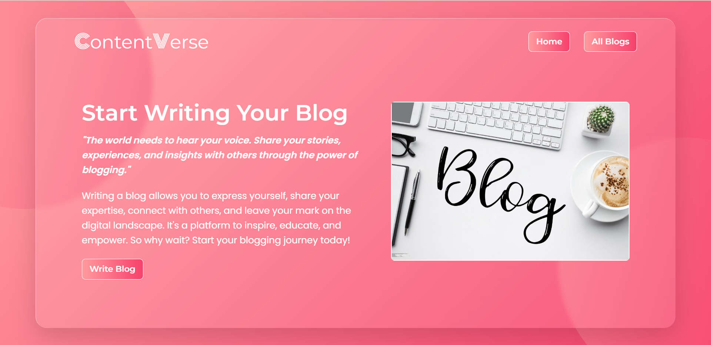
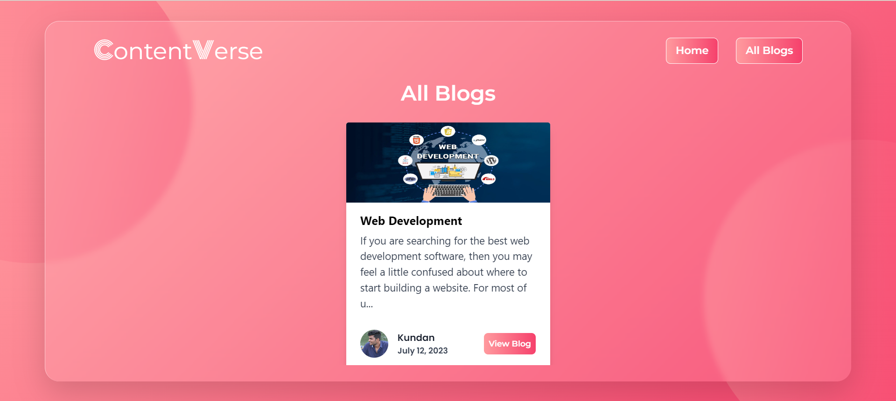
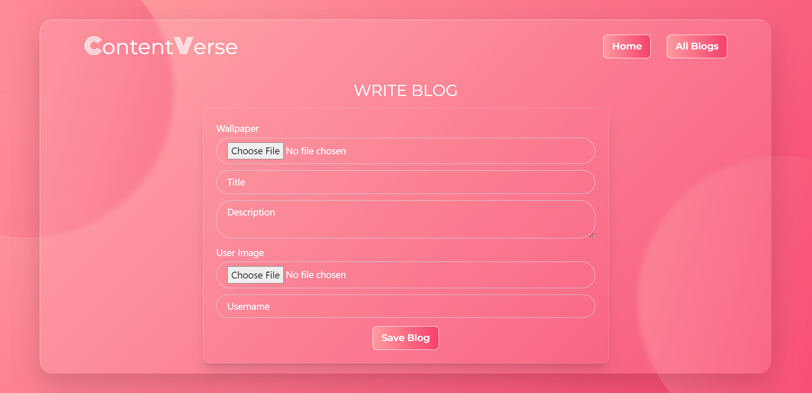
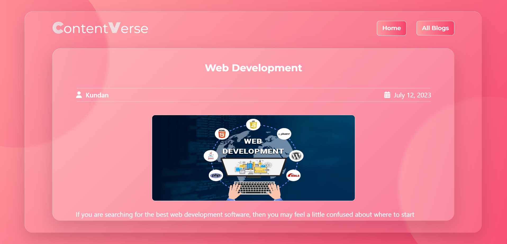

# Content Management Tool :

# [Blog@Live](https://blogapp121.netlify.app/)

# ScreenShots

## About

The blog app allows users to create and share blog posts with a title, description, background image, user image, and username, while providing features for reading, updating, and deleting posts. It utilizes localStorage to store posts locally on the user's device.

## Features

1. Create Blog Posts: Allow users to create new blog posts by providing a form where they can enter a Title,Description,Background image,User image,Username.

2. Read Blog Posts: Display a list of existing blog posts, including their titles and brief descriptions, allowing users to click on a post to view its full content.

3. Update Blog Posts: Enable users to edit their own blog posts, providing an interface to modify the title, content, or any other details of a blog post.

4. Delete Blog Posts: Allow users to delete their own blog posts if they wish to remove them from the app.

5. Local Storage: The app utilizes localStorage, to store blog posts locally on the user's device.

## Technologies Used

- ReactJS
- Tailwind CSS

## Installation

1. Clone the repository to your local machine.
2. Install dependencies by running `npm install` in the terminal.
3. Run `npm run dev` in the terminal to start the app in development mode.
