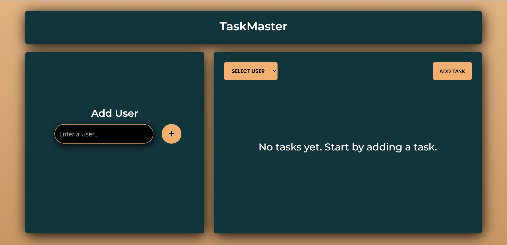
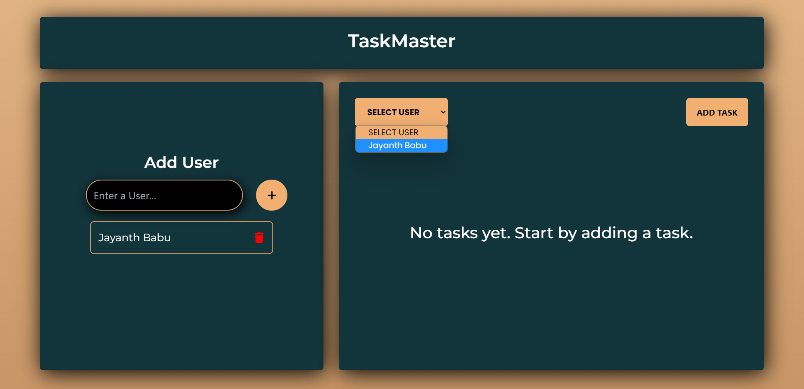
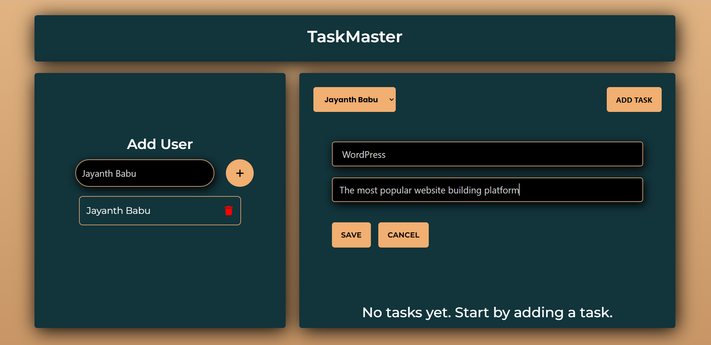
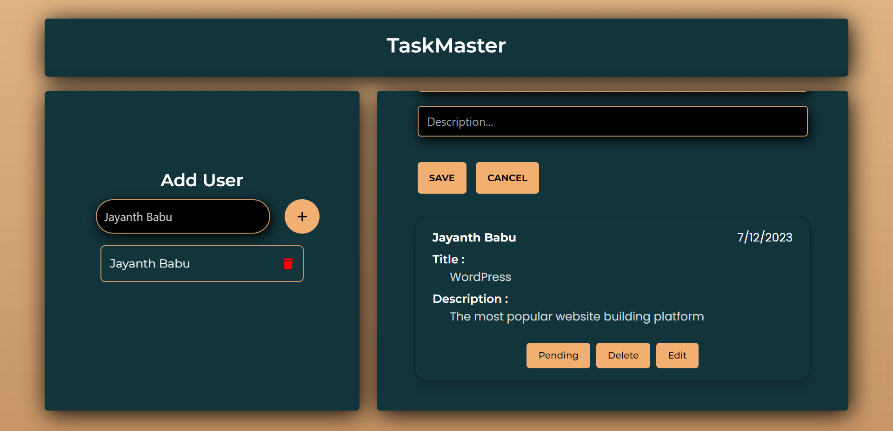

# Project Management Tool :

# [TaskMaster@Live](https://taskmaster121.netlify.app/)

# ScreenShots

## About

The task app allows users to create, view, update, and delete tasks, providing a seamless experience for task management. With localStorage integration, tasks are stored locally, ensuring accessibility and data availability, even without an internet connection. Users can stay organized and keep track of their tasks efficiently.

## Features

1. Create Tasks: Allow users to create new tasks by providing a form where they can enter a Title, Description, Created Date, Username.

2. Read Tasks: Display a list of existing tasks, including their titles and brief descriptions, allowing users to view its full details.

3. Update Tasks: Enable users to edit their own tasks, providing an interface to modify the title, description.

4. Delete Tasks: Allow users to delete their own tasks if they wish to remove them from the app.

5. Local Storage: The app utilizes localStorage to store tasks locally on the user's device, ensuring data availability even when offline.

## Technologies Used

- ReactJS
- Tailwind CSS

## Installation

1. Clone the repository to your local machine.
2. Install dependencies by running `npm install` in the terminal.
3. Run `npm run dev` in the terminal to start the app in development mode.
